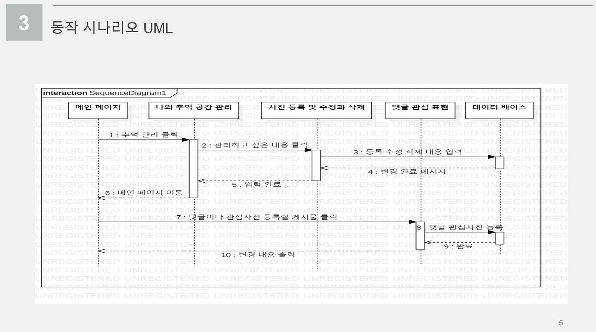
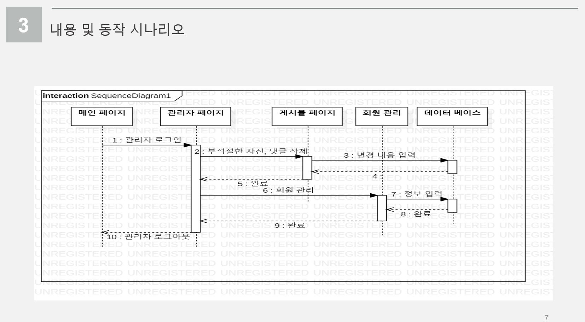

# 봄.See memories_사진 공유 커뮤니티 웹 서비스
## Photo Sharing Community Web Service
사진을 익명으로  올릴 수 있는 자유로운 커뮤니티 웹 서비스입니다.  
It is a Free community web service for posting your photos anonymously.  

### 이찬솔 이종원 이교범 최철환
## Representative email : cch01024857239@gmail.com
## 팀 프로젝트로 진행하였던 웹 서비스 구현입니다.
## This is a web service implementation carried out as a team project.
# 개발환경 (Development environment)
환경|버전
---|---|
Eclipse IDE for EE Developers|19-09|
Ubuntu Server|18.0.4|
oracle JDK|11.0.4|
Tomcat|9.0.22|
MYSQL|5.1.48|
AWS-EC2| |
MySQL Workbench |6.3.10|
 
## 1. 작품선정 배경 및 필요성

## 2. 개발 및 운영환경

## 3. 동작 시나리오 UML

## 4. 일정과 실적

## 5. 역할 분장 
 

## 6. 문제점과 해결방안

# 참고 문헌
*  [jsp 유투브 강의](https://www.youtube.com/watch?v=55sPXGAo-xY)
*  [기본키,외래키 제약조건](https://docs.microsoft.com/ko-kr/sql/relational-databases/tables/primary-and-foreign-key-constraints?view=sql-server-ver15)
* [서버 연동 문제 해결](http://okjsp.pe.kr:8080/article/487885?note=1483650)
* [jsp 유투브 강의](https://www.youtube.com/watch?v=55sPXGAo-xY)
* [서버에서의 컴파일에러 오류](https://mkil.tistory.com/392)
* [sql 조건절](https://webcoding.tistory.com/entry/SQL-WHERE-%EC%A0%88-%EC%82%AC%EC%9A%A9%EA%B3%BC-%EC%A1%B0%EA%B1%B4%EC%97%90-%EC%82%AC%EC%9A%A9%ED%95%A0-%EC%88%98-%EC%9E%88%EB%8A%94-%EC%97%B0%EC%82%B0%EC%9E%90)
* [css 선택자](https://bssow.tistory.com/202)
* [회원가입 시 정규표현](https://wildpup.cafe24.com/archives/696)
* [아마존 EC2 인스턴스 생성 방법](https://wildpup.cafe24.com/archives/696)
* [Star uml 설치법](https://library1008.tistory.com/3)
* [CSS, HTML 코드 예제문 사이트](https://ofcourse.kr)
* > 홈페이지를 위한 HTML JAVA SCRIPT - 김인욱 저, 가메출판사, 2002

 

